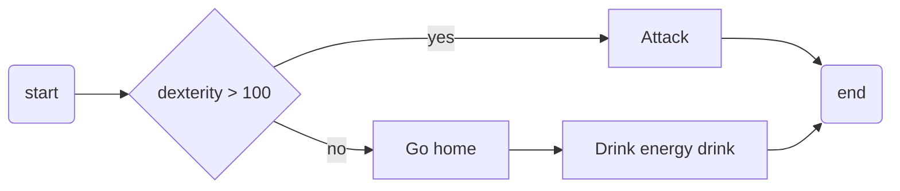
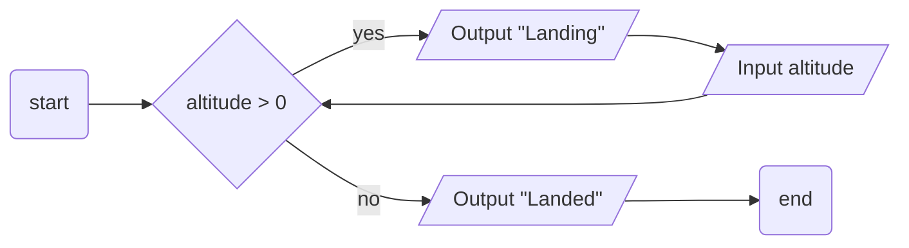
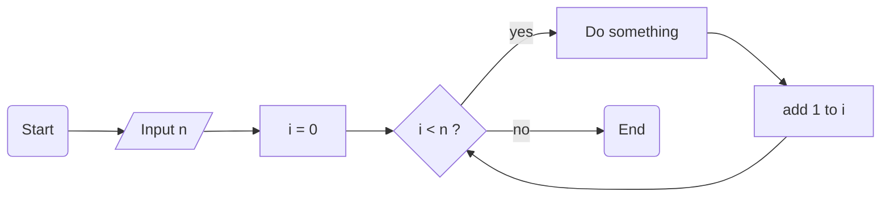
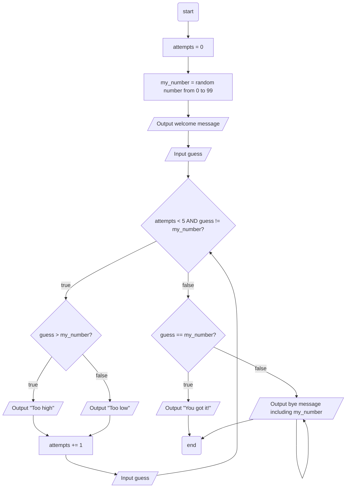

# Programming concepts test

(20 min)

You may **not use any help** unless stated in the text.

## MC

> [!IMPORTANT]
> Provide your answers by editing `quiz-answers.txt` similar to:
> ```txt
> 1,2
> 4
> 3,4
> ```
> Only use `0..9,` symbols.

Which of the **three core programming concepts** are used in the following processes?



1. sequence
2. selection
3. repetition
4. condition
5. data

---



1. sequence
2. selection
3. repetition
4. condition
5. data

---



1. sequence
2. selection
3. repetition
4. condition
5. data
   
## Open ended

How can the three core programming concepts support you in writing software? Provide your answer in `free-response.txt`. 2-3 sentences are plenty.

## Guess my number

You have the following process which describes the game.



<!-- Only this part is different -->
Implement this process in [guess-my-number.py](guess-my-number.py). 
<!-- end -->

The file has all the code lines you need. You only have to arrange them. You can use Code Runner and do not forget to save your solution back in the repository here.
