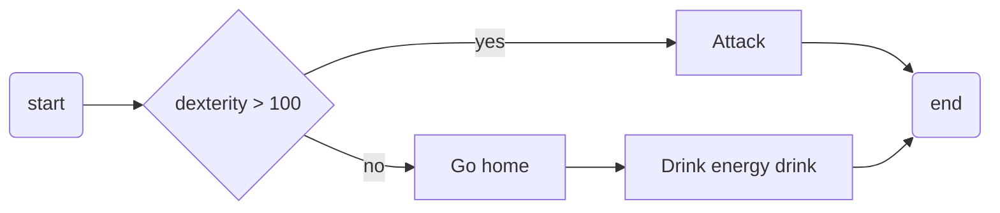
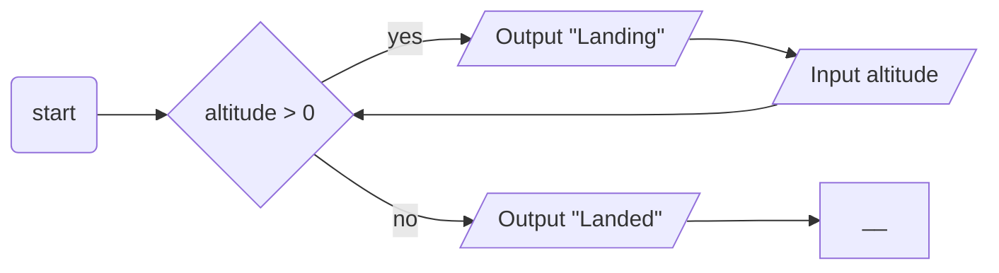
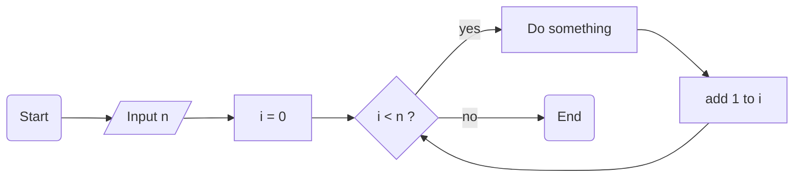

# Programming concepts test

## MC

> [!IMPORTANT]
> Provide your answers by editing `quiz-answers.txt` as follows:
> ```txt
> 1,2
> 4
> 3,4
> ```

Which of the **three core programming concepts** are used in the following processes?



1. sequence
2. selection
3. repetition
4. condition
5. data

---



1. sequence
2. selection
3. repetition
4. condition
5. data

---



1. sequence
2. selection
3. repetition
4. condition
5. data
   
