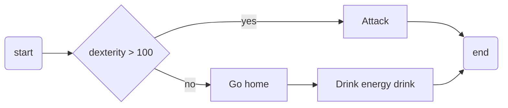
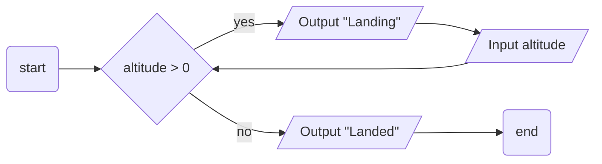
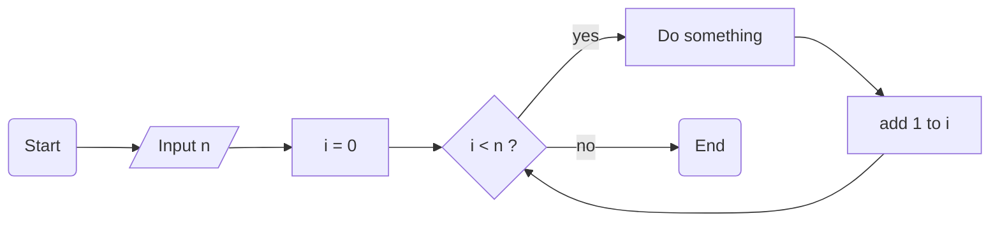
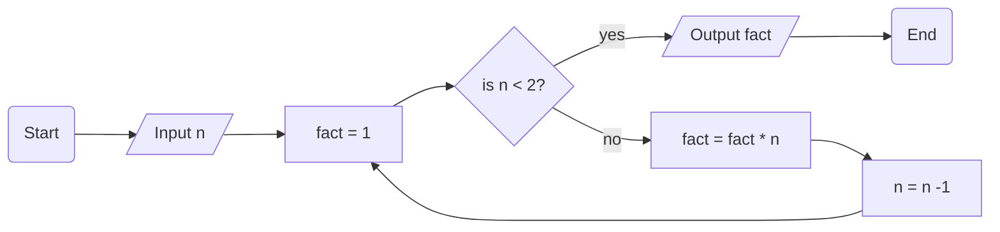

# Programming concepts test

(15 min)

You may **not use any help** unless stated in the text.

## MC

> [!IMPORTANT]
> Provide your answers by editing [`quiz-answers.txt`](quiz-answers.txt) similar to:
> ```txt
> 1,2
> 4
> 3,4
> ```
> Only use `0..9,` symbols.

Which of the **three core programming concepts** are used in the following process?



1. sequence
2. selection
3. repetition
4. condition
5. data

---

Same question.



1. sequence
2. selection
3. repetition
4. condition
5. data

---

Same question.



1. sequence
2. selection
3. repetition
4. condition
5. data

---

Does the text description correspond to the flowchart?


> Calculate `n!`. `!` stands for [factorial](https://simple.wikipedia.org/wiki/Factorial). (0! = 1)



1. Yes
2. No

   
## Open ended

How can the three core programming concepts support you in writing software? Provide your answer in [`free-response.txt`](free-response.txt). 2-3 sentences are plenty.
